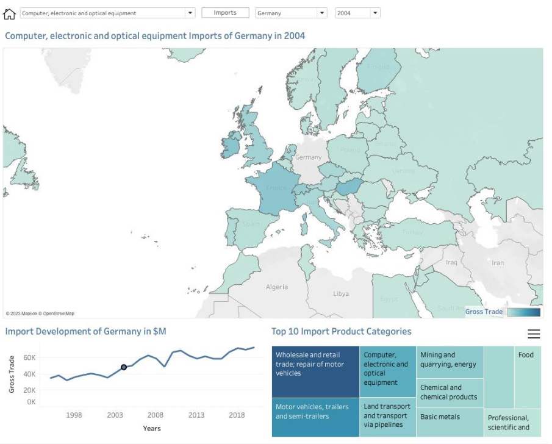
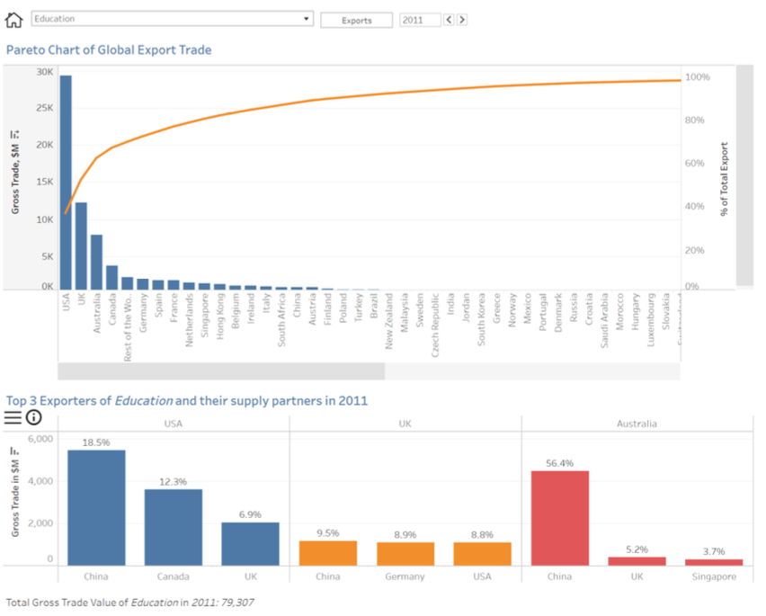

# Global Value Chains and International Trade Analysis

This repository contains a Python script for analyzing global value chains (GVCs) and traditional international trade data from 1995 to 2020. The dashboard displays export and import data for countries across 45 different product categories.

# Introduction

GVCs are a key aspect of modern international trade, breaking up the production process across countries. Firms specialize in specific tasks rather than producing the whole product. GVCs enable firms to raise their productivity and income, while countries partake in GVCs in various ways, such as exporting raw materials or innovative finished products. This project aims to provide a better understanding of international trade, focusing on both GVC and traditional trade.

# Dashboard Design and Design Choices

The dashboard consists of two main pages, providing insights from both country and product category perspectives.

https://public.tableau.com/app/profile/david.bellenberg/viz/final_version_3/P0Home

## Country Perspective
The first page provides information about trade relationships between countries. The main visualizations on this page include:

Interactive world map: Shows trade volumes between countries, with darker colors indicating higher Gross Trade amounts.
Line chart: Displays the development of total Gross Trade over the years, and can be used as a yearly filter.
Treemap: Shows the top imported or exported product categories of the selected country.
Users can filter the entire page by country, product category, and year. They can also switch between import and export values using the toggle at the top right.

## Product Category Perspective
The second page of the dashboard focuses on world trade from a product category perspective. The main visualizations on this page include:

Pareto chart: Shows the gross trade values per country in descending order and the accumulative percentage of the total gross trade.
Bar chart: Presents the top exporters or importers of a selected product category and their most important trading partners.
Users can filter the charts on this page by product category and year. Like the first page, they can switch between exports and imports using the toggle.

# Data Source

The original dataset was obtained from the World Integrated Trade Solutions (WITS), which is a software developed by the World Bank in collaboration with several other organizations. WITS provides knowledge on international merchandise trade, tariff, and non-tariff trade. The dataset used in this project covers gross trade, GVC trade, and traditional trade, expressed in millions of US Dollars.

Please note that the dataset is assumed to be in nominal terms, as there is no indication of a price index being used to adjust for inflation.

https://wits.worldbank.org/gvc/gvc-data-download.html

# Getting Started

## Dependencies
pandas

## Python Script
The Python script main.py processes and cleans the dataset, focusing on GVC and traditional trade data. It includes functions to import datasets, filter and merge them, convert country abbreviations to full names, and clean the dataset. The script can be executed by running the main() function.

# License

This project is licensed under the MIT License. See the LICENSE file for details.

